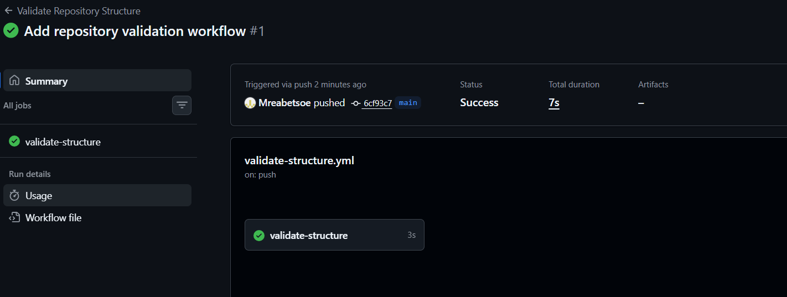

# RaceDay
Planning and database design for the RaceDay event management system

## System Description 
RaceDay is a web-focused event management software developed specifically for the road running, walking and cycling market in South Africa. Organisers and event directors use the site to create and manage events, participants can search for events and enter them and view their results.

## User Roles

### Organiser
Race organiser can add new event or edit existing event, add/edit event categories, see registered participants and results.

### Participant
Users can sign up and log in, search for events, participate in event, and check their performance record. 

## Project Documentation

The planning and database documentation for RaceDay is stored in the `/docs` folder.

The documentation includes:
- Entity Relationship Diagram (ERD)
- RESTful API Endpoint Plan
- SQL Server database creation and seed data script

## CI/CD

The repository uses GitHub Actions to validate the required project structure and documentation. The workflow completed successfully.

